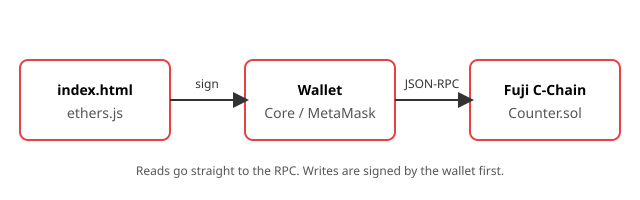

# Build Your First dApp

## Overview

You write a small Solidity contract - a shared counter: one number anyone can read, anyone can increment by one, and only the deployer can reset to zero, announcing every increment as an event - deploy it to the Fuji C-Chain with Foundry, and call it from a single HTML page through your wallet. No framework, no build step. When you are done you have seen the whole path a transaction takes: browser → wallet → RPC node → contract → event → browser.



## Learning objectives

- Compile and deploy a contract with Foundry.
- Read contract state and send a transaction with `cast`.
- Verify a contract on Snowtrace so others can read its source.
- Call a contract from a web page with ethers.js, and react to its events.
- Explain the difference between a read (free, instant) and a write (signed, paid, confirmed).

## Prerequisites

- Completed [Getting Started with Avalanche](../../getting-started/en/README.md): wallet on Fuji with test AVAX.
- A terminal and a text editor (e.g. VS Code).
- python3

## Workshop

### Part 1: Install Foundry (5 min)

[Foundry](https://www.getfoundry.sh/) is the toolchain you use for the rest of the workshop: `forge` compiles, deploys and verifies, `cast` talks to a chain from the terminal.

```sh
curl -L https://getfoundry.sh/install | bash && foundryup
forge --version
```

On Windows, run this inside WSL. If `forge` is not found, open a new terminal so your shell picks up `~/.foundry/bin`.

### Part 2: Write the contract (10 min)

Create the project:

```sh
forge init counter && cd counter
rm -rf src/* test/* script/*
```

Pin the compiler before building. Solidity 0.8.30 and newer target Pectra by default, which the Avalanche C-Chain does not support yet, so add this to `foundry.toml`:

```toml
[profile.default]
solc = "0.8.28"
evm_version = "cancun"   # required for Avalanche
```

Now write `src/Counter.sol` yourself, in three passes. Run `forge build` after each one - a contract that does not compile teaches you more at 5 lines than at 50.

**Pass 1 - state.** A number anyone can read.

```solidity
// SPDX-License-Identifier: MIT
pragma solidity ^0.8.20;

contract Counter {
    uint256 public count;
}
```

`public` on a state variable makes the compiler generate a `count()` getter for you. That is the whole read side of your dApp.

**Pass 2 - behaviour and an event.** Add inside the contract:

```solidity
    event Incremented(address indexed by, uint256 newCount);

    function increment() external {
        count += 1;
        emit Incremented(msg.sender, count);
    }
```

`msg.sender` is whoever signed the transaction. The event is how the outside world hears about the change without polling - Part 6 subscribes to it.

**Pass 3 - access control.** The counter is public, but resetting it should not be. Add a constructor and a guarded function:

```solidity
    address public immutable owner;

    constructor() {
        owner = msg.sender;
    }

    function reset() external {
        require(msg.sender == owner, "only owner");
        count = 0;
    }
```

`immutable` is set once at deployment and then baked into the bytecode: cheaper to read than storage, impossible to change afterwards.

Compare with the reference version in [`Counter.sol`](../assets/Counter.sol) - yours should match, ordering aside. Three questions for your neighbour:

1. Why is `owner` `immutable` and not a normal state variable?
2. What does `emit` actually do, and who can see it?
3. What happens if someone who is not the owner calls `reset()`?

### Part 3: Deploy to Fuji (10 min)

Deploying costs gas, so you need a funded account - and its private key in plain text on your machine. Use a **throwaway testnet account only**. Never put a key that holds real funds into a shell variable, a `.env`, or a workshop.

Create a fresh one:

```sh
cast wallet new
```

It prints an address and a private key. The address is public - share it, fund it, paste it anywhere. The private key is the account: anyone holding it controls the funds, so keep it in this terminal and tuse it only for development.

Import that key into Core so the browser can use the same account: Core → account selector → **Add account** → **Import private key** → paste. The faucet asks you to connect a wallet, and Part 6 needs this account in the browser to sign from the web page.

Then fund it at https://go.team1.network/faucet: select **Fuji (C-Chain)**, connect the imported account, request tokens. Ask the facilitator for a coupon code if the faucet asks for one. Check it arrived:

```sh
cast balance <your-address> --rpc-url https://api.avax-test.network/ext/bc/C/rpc --ether
```

Already have a funded Fuji account from [Getting Started](../../getting-started/en/README.md)? Export its key instead - in Core: Settings → Advanced → Show private key - as long as it is testnet-only.

Put the key and the RPC endpoint in a `.env` in your project root, so you do not paste them into every command. Create the file in your editor with your own key:

```sh
PRIVATE_KEY=0x...   # the key from cast wallet new
RPC=https://api.avax-test.network/ext/bc/C/rpc
```

Make sure the .env is in .gitignore (by default set by foundry)

Now deploy:

```sh
# load .env 
source .env
# deploy
forge create src/Counter.sol:Counter --rpc-url $RPC --private-key $PRIVATE_KEY --broadcast
```

Note the `Deployed to:` address. Open it on https://testnet.snowtrace.io. The contract exists, but the explorer only shows bytecode.

### Part 4: Talk to it from the terminal (5 min)

```sh
COUNTER=0x...   # your 'Deployed to:' address

cast call $COUNTER "count()(uint256)" --rpc-url $RPC            # read: free, no wallet
cast send $COUNTER "increment()" --rpc-url $RPC --private-key $PRIVATE_KEY   # write: signed, paid
cast call $COUNTER "count()(uint256)" --rpc-url $RPC
```

### Part 5: Verify the source (15 min)

On-chain a contract is only bytecode - nobody can tell what it does, and no explorer can offer a working call button. Verifying uploads your source and proves it compiles to exactly that bytecode, so anyone can read what they are about to sign.

Snowtrace is powered by Routescan, which verifies through an Etherscan-compatible endpoint per chain:

```sh
forge verify-contract $COUNTER src/Counter.sol:Counter \
  --verifier-url 'https://api.routescan.io/v2/network/testnet/evm/43113/etherscan' \
  --etherscan-api-key verifyContract \
  --compiler-version 0.8.28 --watch
```

Reload the Snowtrace page. The **Contract** tab now shows your source and lets anyone call `count()` from the browser. Verification is what turns "trust me" into "read it yourself".

### Part 6: The web page (15 min)

Save [`index.html`](../assets/index.html) as `web/index.html` in your project and set `ADDRESS` to your contract. It gets its own folder on purpose: `python3 -m http.server` serves everything below the directory you start it in, and your project root holds `.env`.

```sh
mkdir -p web   # then put index.html in it
cd web && python3 -m http.server 8000
```

Open http://localhost:8000, click **Increment**, approve in your wallet, watch the count change.

Now read the file. Find where each of these happens and mark it with a comment:

- the contract is **read** without a signer
- the wallet is asked to **switch to Fuji**
- the transaction is **signed** and **sent**
- the page **waits for confirmation**
- the page **listens for events** from other people's transactions

Have everyone in the room click Increment on the same contract address. The status line shows every increment, whoever sent it.

## Exercises

1. **Access control.** Add a `reset` button that only appears when the connected account is the owner. Hint: add `"function owner() view returns (address)"` to the ABI.
2. **Gas.** Deploy a second Counter. Compare the deployment gas with the gas of one `increment()` call. Why is the ratio so large?
3. **Break it.** Call `reset()` from a non-owner account with `cast send`. Read the revert reason from the output.
4. **Stretch.** Replace `count += 1` with `count += amount` and a parameter. Redeploy, update the ABI in `index.html`, add an input field.

## Next steps

- Move the contract into a Foundry test (`forge test`) before adding more features.
- Try the same deployment on your own Avalanche L1 in a follow-up workshop.
- Explore the starter kit linked below for a full-stack setup with a framework.

## Resources

- [Foundry book](https://book.getfoundry.sh)
- [ethers.js v6 documentation](https://docs.ethers.org/v6/)
- [Avalanche starter kit](https://github.com/ava-labs/avalanche-starter-kit)
- [Snowtrace testnet](https://testnet.snowtrace.io)
- [Fuji faucet](https://go.team1.network/faucet)
- [Routescan: verifying with Foundry](https://info.routescan.io/en/articles/11992459-deploying-and-verifying-contracts-foundry)
- [Avalanche Foundry quickstart](https://build.avax.network/academy/blockchain/solidity-foundry/03-smart-contracts/03-foundry-quickstart)
- [Avalanche documentation](https://go.team1.network/docs)
