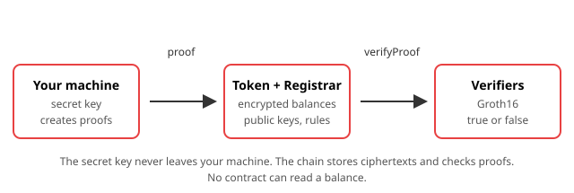

# Deploy Your Own eERC Token

## Overview

On a normal ERC-20, anyone can read every balance and every transfer amount. eERC (Encrypted ERC) is Avalanche's token standard where the amounts are encrypted and the chain only checks a proof that each operation is valid.

In this workshop you install the eERC toolchain, run its tests, deploy a complete private token to the Fuji testnet, register two accounts, mint tokens, read a balance that only you can decrypt, and send a private transfer. Every step is one command. Under each command you see what the output should look like and what the command did.



## Learning objectives

- Install the eERC repository and explain what `npm install` builds for you.
- Deploy eight contracts to Fuji and say what each one does.
- Register a key, mint, read a balance and transfer without any amount appearing on-chain.
- Explain in plain words what a circuit, a proof, a verifier and an auditor are in eERC.
- Name two things this testnet deployment lacks before anyone should use it for real value.

## Prerequisites

- Completed [Build Your First dApp](../../build-your-first-dapp/en/README.md), including a Core wallet with Fuji test AVAX from [Getting Started with Avalanche](../../getting-started/en/README.md).
- Node.js 22. The repository pins `v22.14.0` in `.nvmrc`. Node 18 and 20 are not supported.
- Git, a terminal and a text editor.
- Two dedicated test accounts on Fuji, each with at least 1 test AVAX from the [faucet](https://go.team1.network/faucet). Never use a wallet that holds real funds.
- About 4 GB of free disk space. Compiling the circuits is the heaviest step.

You do not need to know zero-knowledge math. The few terms you need are explained where they appear.

**Facilitators:** Part 2 downloads several hundred megabytes and compiles five circuits. On campus Wi-Fi this can take 15 to 30 minutes. Have participants finish Parts 2 and 3 before the session.

## Workshop

### Part 1: What you are building (5 min)

Three pieces, in plain words:

| Piece | Where it lives | What it does |
|---|---|---|
| Your machine | Laptop | Holds your secret key. Encrypts amounts and creates proofs. |
| Token contract | Fuji | Stores encrypted balances. Cannot read them. |
| Verifier contracts | Fuji | Check that a proof is valid. Return true or false. |

Four words you will see a lot:

- **Circuit.** A program that describes a rule, such as "this transfer amount is not more than my balance." Written in a language called Circom.
- **Proof.** A small piece of data that shows you followed the circuit's rule, without revealing your numbers. You create it on your machine.
- **Verifier.** A contract that checks a proof. Generated from the circuit.
- **Auditor.** One account whose key can also decrypt every amount. This is how eERC supports compliance. Nothing works until an auditor is set.

What stays public: who sent to whom, and when. What stays private: how much, and every balance.

### Part 2: Install (20 to 30 min)

```sh
node --version
```

You should see `v22.x.x`. If the major version is below 22, stop and install Node 22.

```sh
git clone https://github.com/ava-labs/EncryptedERC.git
cd EncryptedERC
npm install
```

This takes a while. `npm install` does more than download packages here: the repository has a `postinstall` step that compiles the Solidity, downloads the Circom 2.1.9 compiler, downloads a Powers of Tau file (shared setup data every zero-knowledge project uses), compiles the five circuits, and generates five verifier contracts. Expect output like:

```text
Compiled NN Solidity files successfully
> No proper compiler found, trying to download...
Compiling 5 circuits...
...
Generating verifiers...
```

Check the result:

```sh
ls contracts/verifiers
```

```text
BurnCircuitGroth16Verifier.sol        RegistrationCircuitGroth16Verifier.sol  WithdrawCircuitGroth16Verifier.sol
MintCircuitGroth16Verifier.sol        TransferCircuitGroth16Verifier.sol
```

Five verifiers, one per circuit: registration, mint, transfer, burn, withdraw. `git status` will show these five files as modified. That is expected: every setup uses fresh randomness, so your verifiers differ slightly from the committed ones. Do not revert them. Your proofs only work with your verifiers.

**If `npm install` fails with `Failed to download a Ptau file`:** the plugin fetches the file from a Google Cloud bucket that has been returning HTTP 403. Download Team1's copy (36 MB), check the hash, and run `npm install` again:

```sh
mkdir -p ~/.zkit/ptau
curl -L -o ~/.zkit/ptau/powers-of-tau-15.ptau https://cdn.team1.network/zkit/powers-of-tau-15.ptau
python3 -c "import hashlib; print(hashlib.blake2b(open('$HOME/.zkit/ptau/powers-of-tau-15.ptau','rb').read()).hexdigest())"
```

```text
982372c867d229c236091f767e703253249a9b432c1710b4f326306bfa2428a17b06240359606cfe4d580b10a5a1f63fbed499527069c18ae17060472969ae6e
```

The hash must match the `hez_final_15` row in the [snarkjs README](https://github.com/iden3/snarkjs#7-prepare-phase-2); it is the same public file every Circom project uses, just hosted by Team1. Original source: circom ([circom.info/powersOfTau28_hez_final_15.ptau](https://circom.info/powersOfTau28_hez_final_15.ptau)). The plugin looks in `~/.zkit/ptau/` first and only downloads when nothing large enough is there.

### Part 3: Run the tests (5 min)

```sh
npx hardhat test test/EncryptedERC-Standalone.ts
```

The last lines should be:

```text
  54 passing (1m)
```

The number may differ by one or two; what matters is `passing` with no `failing`. This runs the whole flow you are about to do on Fuji, on a local chain inside Hardhat: deploy, register, set auditor, mint, transfer, burn, and the cases that must fail. A pass means your toolchain is good. A failure here is cheap to fix; a failure on Fuji costs test AVAX and time.

### Part 4: Configure Fuji (10 min)

The repository ships no Fuji network and never reads a private key, so you add both.

**1. The `.env` file.** Copy [.env.example](../assets/.env.example) to `.env` in the repository root and fill in `PRIVATE_KEY` and `PRIVATE_KEY_2` with your two test accounts. Leave `REGISTRAR` and `ENCRYPTED_ERC` empty for now.

**2. The network.** Open `hardhat.config.ts` and add a `fuji` entry inside `networks`, next to the existing `hardhat` entry:

```ts
networks: {
  hardhat: {
    // leave the existing block as it is
  },
  fuji: {
    url: process.env.RPC_URL || "https://api.avax-test.network/ext/bc/C/rpc",
    chainId: 43113,
    accounts: [process.env.PRIVATE_KEY, process.env.PRIVATE_KEY_2].filter(
      (k): k is string => !!k,
    ),
  },
},
```

**3. The scripts.** Copy the six files from this workshop's [assets/scripts](../assets/scripts/) folder into the `scripts/` folder of your clone, and keep your key file out of git:

```sh
printf '\n.eerc-keys.json\n' >> .gitignore
```

**4. Check you are talking to Fuji:**

```sh
(set -a; source .env; set +a; curl -s -X POST -H "Content-Type: application/json" \
  --data '{"jsonrpc":"2.0","method":"eth_chainId","params":[],"id":1}' "$RPC_URL")
```

```text
{"jsonrpc":"2.0","id":1,"result":"0xa869"}
```

`0xa869` is 43113 in decimal, the Fuji C-Chain. If you see anything else, fix `RPC_URL` before going on.

The parentheses run the check in a throwaway subshell, so nothing from `.env` stays exported in your terminal. That matters: Hardhat reads `.env` itself on every run and will not overwrite a variable that is already set in the shell, so a stale exported value would hide the addresses you add to `.env` in Part 5.

From here on, every command starts with `npx hardhat run` and ends with `--network fuji`. Newer npm versions print two `npm notice run ...` lines first; ignore them.

| Field | Value |
|---|---|
| Network name | Avalanche Fuji C-Chain |
| RPC URL | `https://api.avax-test.network/ext/bc/C/rpc` |
| Chain ID | `43113` |
| Currency | `AVAX` |
| Explorer | `https://testnet.snowtrace.io` |

### Part 5: Deploy (10 min)

```sh
npx hardhat run scripts/deploy.ts --network fuji
```

```text
Deployer: 0xYourFirstAccount
┌──────────────────────┬──────────────────────────────────────────────┐
│ registrationVerifier │ '0x...'                                      │
│ mintVerifier         │ '0x...'                                      │
│ withdrawVerifier     │ '0x...'                                      │
│ transferVerifier     │ '0x...'                                      │
│ burnVerifier         │ '0x...'                                      │
│ babyJubJub           │ '0x...'                                      │
│ registrar            │ '0x...'                                      │
│ encryptedERC         │ '0x...'                                      │
└──────────────────────┴──────────────────────────────────────────────┘

Add these two lines to .env:
REGISTRAR=0x...
ENCRYPTED_ERC=0x...
```

Paste those two lines into `.env`. Every later script reads them.

Eight contracts went up:

| Contract | Does |
|---|---|
| Five verifiers | Each checks one kind of proof |
| `babyJubJub` | Math library for the curve the encryption uses. Deployed once, shared by the token |
| `registrar` | Phone book of public keys. One address, one key |
| `encryptedERC` | The token. Holds encrypted balances and the addresses of the other seven |

The script deploys the verifiers you generated in Part 2 (`deployVerifiers(deployer, false)`). The repository's own `scripts/deploy-standalone.ts` deploys an older set from `contracts/prod/` that does not match the current circuits, so do not use it here. Your token's name and symbol come from `.env`.

### Part 6: Register your keys (10 min)

```sh
npx hardhat run scripts/register.ts --network fuji
```

```text
0xYourFirstAccount registered. tx: 0x...
  public key: [1234..., 5678...]
0xYourSecondAccount registered. tx: 0x...
  public key: [9012..., 3456...]
```

Each account now has an encryption key in the registrar. The script made a fresh key pair for each account, saved the private half in `.eerc-keys.json` (keep this file; without it you cannot decrypt your balances), and sent only the public half plus a proof. The proof shows you hold the matching private key without sending it. Run the script again and it prints `already registered, skipping`: one address, one registration.

### Part 7: Set the auditor (5 min)

```sh
npx hardhat run scripts/set-auditor.ts --network fuji
```

```text
Auditor set to 0xYourFirstAccount. tx: 0x...
  auditor public key: [1234..., 5678...]
```

For this workshop your first account is also the auditor. Until this is set, every mint, transfer and burn fails with `Auditor public key not set`. This is the most common reason a fresh eERC deployment looks broken. Every proof from now on also encrypts the amount under this key, so the auditor can read it. Nobody else can.

### Part 8: Mint (5 min)

```sh
npx hardhat run scripts/mint.ts --network fuji
```

```text
Generating mint proof for 1000 units...
Minted 1000 units to 0xYourFirstAccount. tx: 0x...
  gas used: 761524
```

Amounts are in the smallest unit. With 2 decimals, 1000 means 10.00 tokens. Pass a different amount with `AMOUNT=5000 npx hardhat run ...`.

Open the transaction on [testnet.snowtrace.io](https://testnet.snowtrace.io) and look at the input data. You will find proof points and encrypted values. The number 1000 is not there. The `PrivateMint` event shows who received tokens, not how many.

Only the owner (your deployer account) can mint. Each mint proof carries a one-time tag called a nullifier; sending the same proof twice fails with `InvalidProof`.

### Part 9: Read your balance (5 min)

```sh
npx hardhat run scripts/balance.ts --network fuji
```

```text
0xYourFirstAccount
  encrypted balance on-chain (c1): [1234...,5678...]
  decrypted balance:              1000 units
0xYourSecondAccount
  encrypted balance on-chain (c1): [0,0]
  decrypted balance:              0 units
```

Two steps happen. First the script fetches the ciphertext from the contract, which anyone can do. Then it decrypts with the private key from `.eerc-keys.json`, which only you can do. The contract itself never knows the number 1000.

Use the wrong key and decryption throws an error instead of returning a wrong number. That is by design.

### Part 10: Private transfer (10 min)

```sh
npx hardhat run scripts/transfer.ts --network fuji
```

```text
Sender balance: 1000 units. Transferring 250...
Transferred 250 units to 0xYourSecondAccount. tx: 0x...
  gas used: 1129196
```

Run `scripts/balance.ts` again: 750 and 250.

What the proof shows, in plain words: "I own this key. My encrypted balance decrypts to a number. The amount is not more than that number. I encrypted the same amount for the receiver, for myself and for the auditor." The contract then subtracts from your encrypted balance and adds to the receiver's without decrypting either. That is possible because the encryption used here lets you add and subtract ciphertexts directly.

Gas: this first transfer cost 1,129,196 on Fuji and the mint 761,524. The repository's own gas report averages 947,000 for a transfer and 722,000 for a mint; your first transfer pays extra because the receiver's balance storage is written for the first time. A normal ERC-20 transfer is about 50,000 to 65,000. Around 380,000 of the transfer cost is checking the proof; the rest is curve math and storage.

### Part 11: Try to break it (10 min)

**Spend more than you have.**

```sh
AMOUNT=999999 npx hardhat run scripts/transfer.ts --network fuji
```

The script fails on your machine while generating the proof. No transaction is sent and no gas is spent. The rule "amount is not more than balance" is enforced before anything reaches the chain.

**Skip the auditor.** If you deploy a fresh stack and run `mint.ts` before `set-auditor.ts`, the transaction reverts with `Auditor public key not set`. Compare that with a bad proof, which reverts with `InvalidProof`. Knowing which layer rejected you saves a lot of debugging time.

**Lose your key.** Rename `.eerc-keys.json` and run `balance.ts`. The script creates new keys and decryption throws, because the on-chain balance is encrypted under the old key. Rename the file back. There is no recovery path for a lost eERC key; a production wallet derives it from a signature instead of storing a random one.

### Part 12: What this is not (5 min)

Your token works, with real encryption and real proofs, on a testnet. Before anyone uses it for value:

| Gap | Why it matters |
|---|---|
| Trusted setup | `npm install` ran the key-generation ceremony on your laptop alone. Whoever controls that machine could forge proofs. Production needs a multi-party ceremony with a published transcript. |
| Audits | The eERC code was audited in March 2025 (reports in the repository's `audit/` folder). The circuits changed since, including security fixes in August 2026. |
| Key management | Keys here live in a JSON file. Lose it and the balance is gone. |
| Who can see what | Sender, receiver and timing are public. Only amounts are private. |

## Next steps

- Take the [eERC Token Standard course](https://build.avax.network/academy/blockchain/encrypted-erc) on Avalanche Academy for the compliance and use-case side.
- Deploy converter mode, which wraps an existing ERC-20 with the same five circuits: copy `scripts/deploy-converter.ts`, change `deployVerifiers(deployer, true)` to `false`, and run it with `--network fuji`.
- Read the [audit reports](https://github.com/ava-labs/EncryptedERC/tree/main/audit) before using eERC beyond a testnet.

## Resources

- [EncryptedERC repository](https://github.com/ava-labs/EncryptedERC)
- [eERC documentation on AvaCloud](https://docs.avacloud.io/encrypted-erc)
- [eERC Token Standard course, Avalanche Academy](https://build.avax.network/academy/blockchain/encrypted-erc)
- [hardhat-zkit plugin](https://github.com/dl-solarity/hardhat-zkit)
- [Circom documentation](https://github.com/iden3/circom/tree/master/mkdocs/docs)
- [Avalanche documentation](https://go.team1.network/docs)
- [Fuji faucet](https://go.team1.network/faucet)
- [Fuji explorer (Snowtrace)](https://testnet.snowtrace.io)
